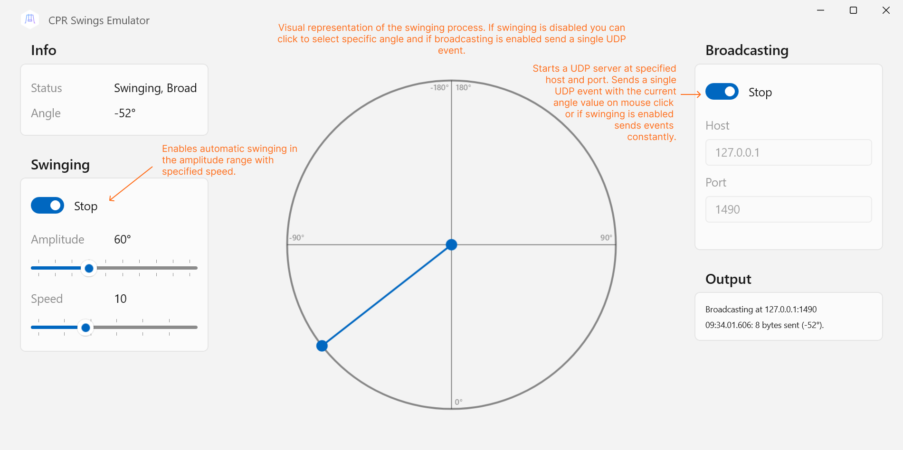

# CPR Swings Sample

A sample Unity project displaying how to use data from tilt sensor or swing emulator. Angle values received from the sensor are applied to the cube's transform and the cube is rotating according to the swings movements.

## How it works?

The swing sensor (or emulator) is constantly sending UDP events to localhost via `1490` port. The data received in these UDP events is represented by `8 bytes` which produce a double value. This double value is in the range form `-180° to 180°` where 0° is the swing idle position, 180° is the swing's max forward position and -180° is the max backwards one.

In order to receive angle values from the swing sensor the game needs to instantiate a `UdpClient` class and listen to the port updates. You can find basic implementation of this functionality in `Assets/UDPListener.cs` file of this project.

## How to use CPR Swings Emulator?

- <a href="https://drive.google.com/file/d/1eB3jrK-1P-pxEX7-j299lSSuIWtgOX_D/view?usp=sharing">Download</a> and install CPR Swings Emulator msix package.
- If Windows complains about app's publisher install the certificate by double clicking and adding it to Local machine -> Trusted People. You can find the file inside the downloaded zip folder.
- Toggle switches to start swinging and/or broadcasting events through a UDP server.
- Adjust swinging amplitude and speed with sliders.
- Select current angle by clicking in the circle area.

